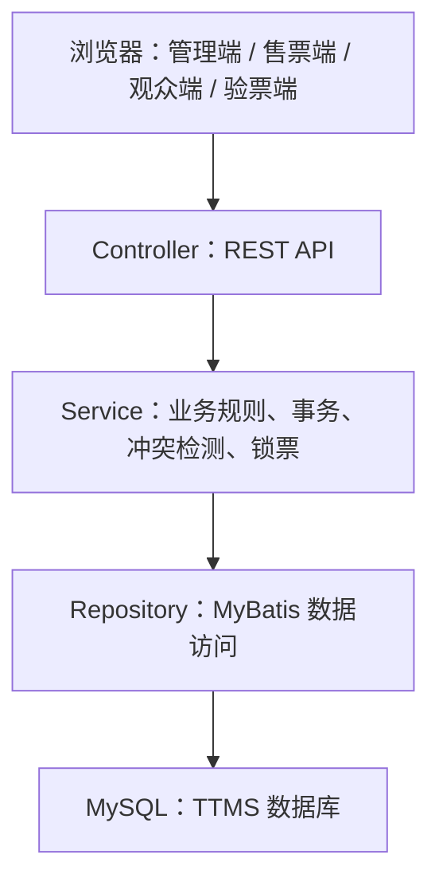

# TTMS 完整项目架构

## 目标

本项目按《TTMS_需求规格说明书.docx》建立 B/S 架构骨架，覆盖剧院管理、剧目排期、售票退票、入场验票、财务统计、用户权限与观众端入口。

## 技术栈

- 后端：Spring Boot 3、Spring Web、MyBatis、Spring Security、MySQL。
- 前端：React、TypeScript、Vite、React Router、Ant Design、Axios、Zustand。
- 数据库：MySQL 8，集中式关系数据存储。
- 部署形态：浏览器前端访问 Tomcat/Spring Boot 服务端，服务端访问 MySQL。

## 目录结构

```text
ttms/
  backend/                Spring Boot 后端
    src/main/java/com/hantang/ttms/
      controller/         REST 接口层
      service/            业务接口
      service/impl/       业务实现与事务边界
      repository/         MyBatis Mapper 持久化接口
      domain/             领域实体
      dto/                请求 DTO
      common/             统一响应、异常
      config/             Web 配置
      security/           安全配置
ttms-frontend/            React 管理端/观众端
  src/services/           API 封装
  src/routes/             路由
  src/stores/             会话与业务状态
  src/pages/              业务页面
  database/               MySQL 建表与初始化脚本
  docs/                   架构、接口和部署说明
```

## 后端分层



## 核心业务边界

- 演出厅管理：维护演出厅、座位布局，新增演出厅时可生成座位。
- 剧目管理：维护剧目类型、语种、简介、海报、时长和票价。
- 演出计划：创建排期时检测同一演出厅的时间冲突，创建后生成演出票。
- 售票：选座后锁票，支付成功后创建销售单和明细，并将票据置为已售。
- 退票：已验票不可退，退票时更新销售单和票据状态。
- 验票：仅 SOLD 状态票据允许入场，验票后置为 CHECKED。
- 财务：基于 sales、sale_items、tickets 汇总日销售、票房和上座率。

## 关键一致性策略

- 票据表 `tickets.version` 保留版本字段，MyBatis 更新票据时显式递增。
- 下单时票据从 `AVAILABLE` 变为 `LOCKED`，并记录 `lock_time`。
- 支付确认时检查锁票状态和超时时间，再统一更新销售单、销售明细和票据状态。
- 售票、支付、退票、生成票据等跨表操作全部放在 `@Transactional` 边界内。

## 权限模型

当前骨架包含 `employees`、`roles`、`resources`、`employee_roles`、`role_resources` 表。后续可在 Spring Security 中接入 JWT 或 Session，并基于资源 URL 做细粒度授权。
