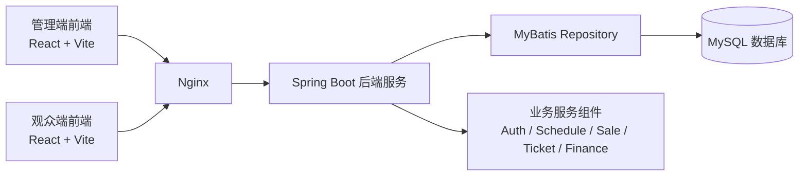
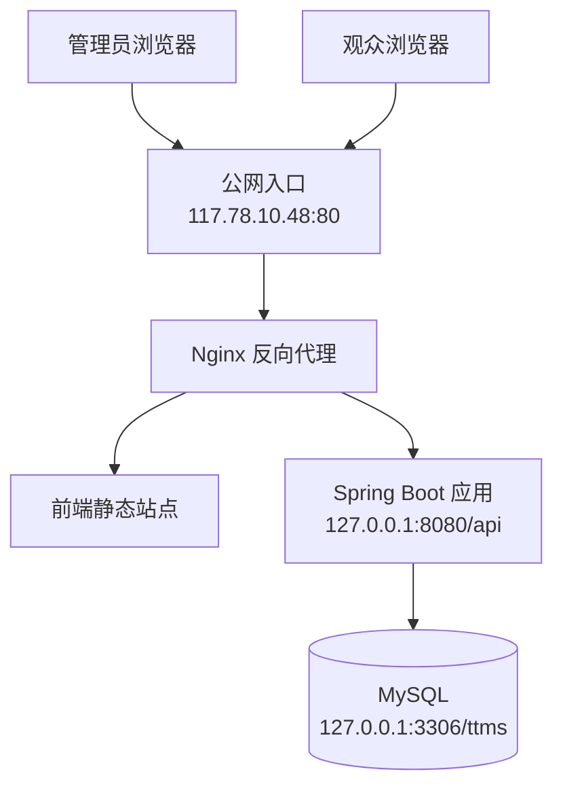
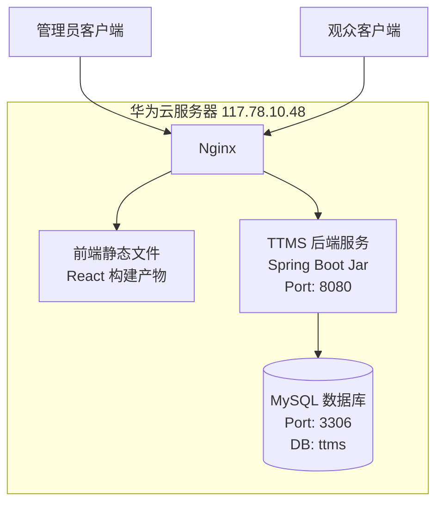

# 7. 开发架构设计

本节给出 TTMS（剧院票务管理系统）的开发架构设计。系统采用前后端分离开发模式，前端基于 React + TypeScript + Vite 构建，后端基于 Spring Boot + MyBatis 构建，数据库采用 MySQL。整体上按照“界面层 - 业务层 - 数据访问层 - 数据存储层”进行组织，以支撑管理端与观众端两类业务场景。

## 7.1 工程结构

项目采用单仓库组织方式，工程目录按前端、后端、数据库脚本和文档分区管理，结构清晰，便于分工开发与后期维护。

```text
ttms/
├── backend/                     # Spring Boot 后端工程
│   ├── src/main/java/com/hantang/ttms
│   │   ├── common/              # 通用响应、异常处理
│   │   ├── config/              # Web 跨域等配置
│   │   ├── controller/          # 控制器层，对外提供接口
│   │   ├── domain/              # 领域实体对象
│   │   ├── dto/                 # 数据传输对象
│   │   ├── repository/          # MyBatis 数据访问层
│   │   ├── security/            # 安全配置
│   │   ├── service/             # 业务接口
│   │   ├── service/impl/        # 业务实现
│   │   └── TtmsApplication.java # 后端启动入口
│   ├── src/main/resources/
│   │   └── application.yml      # 后端配置文件
│   └── pom.xml                  # Maven 依赖与构建配置
├── frontend/                    # React 前端工程
│   ├── public/                  # 静态资源
│   ├── src/
│   │   ├── components/          # 通用与业务组件
│   │   ├── hooks/               # 自定义 Hook
│   │   ├── layouts/             # 管理端/观众端布局
│   │   ├── mocks/               # Mock 数据与拦截器
│   │   ├── pages/               # 页面级组件
│   │   ├── routes/              # 路由配置
│   │   ├── services/            # API 请求封装
│   │   ├── stores/              # Zustand 状态管理
│   │   ├── styles/              # 全局样式
│   │   ├── types/               # TypeScript 类型定义
│   │   ├── App.tsx              # 路由根组件
│   │   └── main.tsx             # 前端启动入口
│   ├── package.json             # 前端依赖与脚本
│   └── vite.config.ts           # Vite 配置与开发代理
├── database/
│   ├── schema.sql               # 数据库表结构脚本
│   └── seed.sql                 # 初始化数据脚本
└── docs/                        # 需求、设计、接口及过程文档
```

从工程结构上看，系统具有以下特点：

- 前后端分离明显，前端专注页面交互与路由组织，后端专注接口与业务实现。
- 后端遵循典型分层架构，Controller、Service、Repository、Domain 分工明确。
- 前端按“页面、路由、状态、服务”维度组织，符合中型业务系统的工程规范。
- 数据库脚本独立管理，便于初始化环境、复现实验过程和后期部署。

## 7.2 源代码文件

本小节说明项目主要源代码文件的构成及其与软件逻辑单元之间的关系。

### 7.2.1 前端源代码构成

前端采用 React 单页应用模式，根组件通过浏览器路由统一挂载管理端与观众端功能模块。前端源码与逻辑单元的关系如表所示。

| 源码目录/文件 | 逻辑单元 | 说明 |
| --- | --- | --- |
| `src/main.tsx` | 前端启动单元 | 初始化 React 应用，按环境变量决定是否启用 Mock。 |
| `src/App.tsx` | 根路由单元 | 聚合管理端与观众端路由，完成全局主题与路由挂载。 |
| `src/routes/admin.routes.tsx` | 管理端导航单元 | 定义工作台、演出厅、剧目、排期、售票、退票、验票、用户、财务等页面路由。 |
| `src/routes/customer.routes.tsx` | 观众端导航单元 | 定义首页、排期、选座、订单、钱包、个人中心等页面路由。 |
| `src/layouts/` | 页面框架单元 | 实现管理端与观众端的整体页面布局。 |
| `src/pages/admin/` | 管理业务单元 | 实现后台管理相关页面。 |
| `src/pages/customer/` | 观众业务单元 | 实现在线购票相关页面。 |
| `src/services/` | 接口调用单元 | 封装 Axios 请求，与后端兼容接口对接。 |
| `src/stores/` | 前端状态单元 | 使用 Zustand 管理登录态、购物流程等前端状态。 |
| `src/components/` | 复用组件单元 | 封装表格、搜索、权限守卫、状态标签等可复用组件。 |
| `src/mocks/` | 联调支持单元 | 在后端未完成时提供 Mock 数据，支持前后端并行开发。 |

从逻辑上看，前端代码主要围绕两个子系统展开：

- 管理端子系统：用于剧目管理、演出计划管理、演出厅管理、售票、退票、验票、用户管理和财务统计。
- 观众端子系统：用于剧目浏览、场次查询、选座购票、支付、订单管理、钱包和个人资料维护。

### 7.2.2 后端源代码构成

后端采用 Spring Boot 分层架构实现，主要源码文件与逻辑单元的关系如下。

| 源码目录/文件 | 逻辑单元 | 说明 |
| --- | --- | --- |
| `TtmsApplication.java` | 系统启动单元 | 启动 Spring Boot 应用，并扫描 MyBatis Repository。 |
| `controller/` | 接口控制单元 | 接收前端请求，进行参数绑定和结果返回。 |
| `service/` | 业务抽象单元 | 定义剧目、排期、售票、验票、财务等核心业务接口。 |
| `service/impl/` | 业务实现单元 | 实现票状态流转、订单支付、排期冲突检测等核心业务逻辑。 |
| `repository/` | 数据访问单元 | 通过 MyBatis 注解 SQL 完成数据库访问。 |
| `domain/` | 领域模型单元 | 定义演出厅、座位、剧目、场次、票、顾客、员工、销售单等对象。 |
| `dto/` | 数据传输单元 | 适配前后端接口的输入输出结构。 |
| `common/` | 公共基础单元 | 统一响应、分页结果、业务异常与全局异常处理。 |
| `config/` | 基础配置单元 | 配置跨域访问等 Web 行为。 |
| `security/` | 安全配置单元 | 配置 Spring Security 和密码编码器。 |
| `src/main/resources/application.yml` | 运行配置单元 | 配置端口、上下文路径、数据源、跨域与票锁定时间。 |

后端业务逻辑可进一步概括为以下几类核心单元：

- 用户认证单元：处理管理员和顾客登录、注册、身份识别。
- 票务处理单元：处理锁票、下单、支付、退票、验票等流程。
- 场次管理单元：处理演出计划创建、冲突检测和票自动生成。
- 基础资料管理单元：处理剧目、演出厅、座位、员工、顾客、角色等信息。
- 财务统计单元：处理销售汇总、剧院收入分析、员工日销售额等统计需求。

### 7.2.3 数据与文档文件构成

除前后端源码外，本系统还包含数据库和设计文档相关文件，用于支撑系统运行与研发交付。

| 文件/目录 | 逻辑单元 | 说明 |
| --- | --- | --- |
| `database/schema.sql` | 数据结构单元 | 定义系统核心表结构和约束。 |
| `database/seed.sql` | 初始化数据单元 | 提供基础测试数据和角色数据。 |
| `docs/接口设计文档.md` | 接口规范单元 | 说明管理端与观众端兼容接口。 |
| `docs/TTMS软件设计与需求分析.md` | 需求与总体设计单元 | 说明业务背景、功能需求和设计方案。 |

## 7.3 系统组件

从组件视角看，TTMS 系统由前端展示组件、业务服务组件、数据库组件与反向代理组件共同组成。系统的开发组件关系如图所示。



按照组件职责可以划分为以下几层：

### 7.3.1 表现层组件

- 管理端前端组件：为管理员、售票员、检票员等角色提供后台页面。
- 观众端前端组件：为普通顾客提供在线选座、购票、支付和订单查询界面。
- 路由与布局组件：负责页面导航、访问控制和整体布局组织。

### 7.3.2 接口与业务层组件

- 兼容接口组件：对外暴露 `/admin/api/*` 和 `/customer/api/*` 两类接口，统一响应格式，适配前端调用。
- 业务服务组件：包括 `AuthService`、`ScheduleService`、`SaleService`、`TicketService`、`FinanceService` 等，是系统核心业务中枢。
- 公共处理组件：统一异常处理、统一响应结构和跨域配置。

### 7.3.3 数据访问层组件

- Repository 组件：负责将业务对象持久化到数据库。
- Domain 组件：定义业务实体，如剧目、场次、票、销售单、顾客、员工等。

### 7.3.4 数据存储组件

- MySQL 数据库：用于存储剧目、场次、座位、票、订单、顾客、员工、角色权限等业务数据。

系统组件之间的协作关系如下：

1. 用户通过浏览器访问前端页面。
2. 前端页面调用后端兼容接口。
3. 控制器层将请求分发给业务服务层。
4. 业务服务层调用 Repository 完成数据库读写。
5. 数据库返回结果后，逐层返回至前端页面完成展示。

# 8. 物理架构设计

本节给出 TTMS 系统的物理部署方案。当前系统部署在华为云服务器中，对外通过 Nginx 提供静态资源分发与反向代理服务，后端服务运行于应用端口，数据库运行于本机 MySQL 实例。

## 8.1 网络环境

### 8.1.1 网络拓扑架构

根据本地源码配置、公网访问验证结果以及云端部署说明，系统网络拓扑可描述为“公网用户访问华为云主机，Nginx 负责接入和转发，Spring Boot 负责业务处理，MySQL 负责数据存储”。网络拓扑架构图如下。



### 8.1.2 网络访问关系

系统当前可确认的访问关系如下：

- 对外访问入口为华为云公网 IP：`117.78.10.48`。
- Web 服务接入端口为 `80`，公网访问返回头显示服务器为 `nginx/1.18.0 (Ubuntu)`。
- 后端应用端口为 `8080`，上下文路径为 `/api`。
- 数据库连接地址为 `localhost:3306/ttms`，说明数据库与后端部署在同一台云服务器内部网络中。
- 前端开发代理中存在 `/admin/api` 与 `/customer/api` 两类接口路径，部署后预计仍通过 Nginx 转发到后端。

### 8.1.3 资源配置

当前已核实和可从代码中确认的资源配置如下表所示。

| 资源项 | 配置情况 | 说明 |
| --- | --- | --- |
| 云平台 | 华为云 | 系统部署于华为云服务器。 |
| 公网地址 | `117.78.10.48` | 用户通过该地址访问系统。 |
| Web 接入服务 | `Nginx 1.18.0 (Ubuntu)` | 已通过公网响应头验证。 |
| 前端部署方式 | 静态资源部署 | 前端由 Vite 构建后以静态文件方式交付给 Nginx。 |
| 后端运行方式 | Spring Boot 独立服务 | 后端监听 `8080` 端口，对外上下文路径为 `/api`。 |
| 数据库 | MySQL | 数据库名称为 `ttms`。 |
| 数据库连接 | `jdbc:mysql://localhost:3306/ttms` | 后端与数据库部署在同机。 |
| 应用访问模式 | 反向代理 | Nginx 统一接入并转发前后端请求。 |

说明：由于当前环境无法从外部通过 SSH 连接到该服务器的 `22` 端口，因此服务器 CPU、内存、磁盘容量等宿主机规格尚未在本文中写入。若后续需要提交最终版文档，可在华为云控制台或服务器本机执行 `lscpu`、`free -h`、`df -h` 后补充到本表。

## 8.2 部署方案

### 8.2.1 部署思路

系统采用单机部署方案，前端、后端和数据库统一部署在同一台华为云服务器中，由 Nginx 作为统一入口。该方案适合课程设计与中小规模业务场景，部署简单、维护成本低、便于快速验收。

部署流程如下：

1. 前端项目通过 `pnpm build` 或 `npm run build` 生成静态资源。
2. 构建产物部署到 Nginx 的站点目录，由 Nginx 直接对外提供页面访问。
3. 后端项目通过 Maven 打包为可执行 Jar 包，并以 Java 进程方式运行在 `8080` 端口。
4. Nginx 根据路径规则将页面请求转发给静态站点，将接口请求转发给 Spring Boot 服务。
5. Spring Boot 服务通过 JDBC 连接本机 MySQL 数据库完成数据读写。

### 8.2.2 部署图

系统部署图如下所示。



### 8.2.3 Nginx 代理策略

结合当前项目结构，Nginx 在部署中的主要职责如下：

- 代理根路径 `/`，返回前端构建后的静态页面。
- 将观众端接口路径 `/customer/api/*` 转发至后端 Spring Boot 服务。
- 将管理端接口路径 `/admin/api/*` 转发至后端 Spring Boot 服务。
- 统一处理跨域接入、静态资源访问与前端路由刷新问题。

在实际运行中，推荐采用如下逻辑：

- 页面资源：由 Nginx 直接读取磁盘中的前端构建产物。
- 接口请求：由 Nginx 反向代理至 `http://127.0.0.1:8080`。
- 数据访问：由 Spring Boot 服务访问 `localhost:3306` 上的 MySQL。

### 8.2.4 部署方案优点

本部署方案具有以下优点：

- 架构简单，适合课程设计项目快速落地。
- 统一入口明确，便于浏览器访问和后端接口管理。
- Nginx 可以屏蔽应用服务端口，提升系统的访问组织性。
- 前后端职责清晰，便于后续拆分成独立部署形态。

### 8.2.5 后续扩展建议

若系统后续面向更大访问规模或正式上线，可在现有部署基础上逐步演进：

- 将前端静态资源迁移到对象存储或 CDN。
- 将 MySQL 独立为云数据库实例，降低单机耦合。
- 将锁票会话迁移到 Redis，以提升并发场景下的可靠性。
- 将 Nginx 与应用服务拆分为多节点部署，并引入负载均衡。

